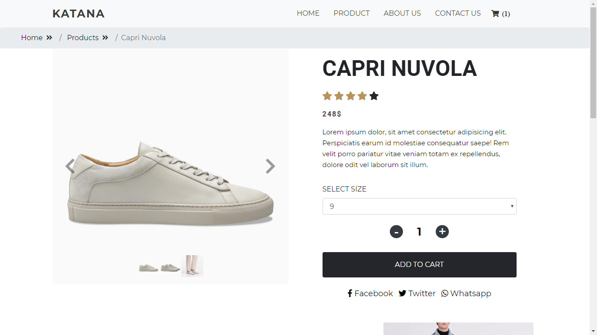
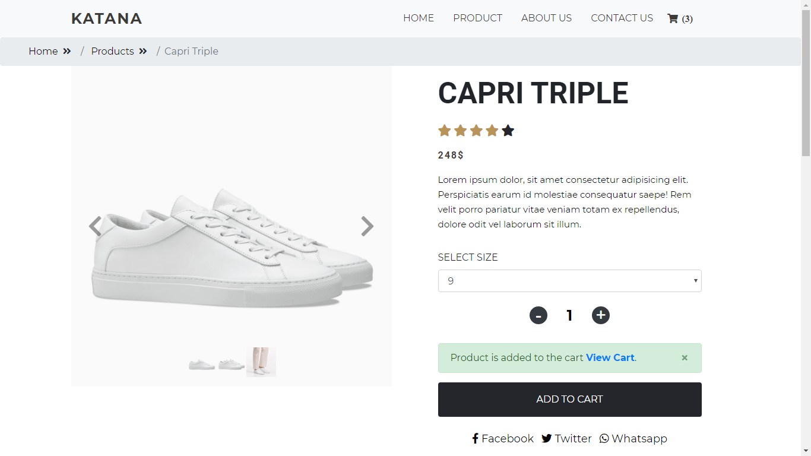
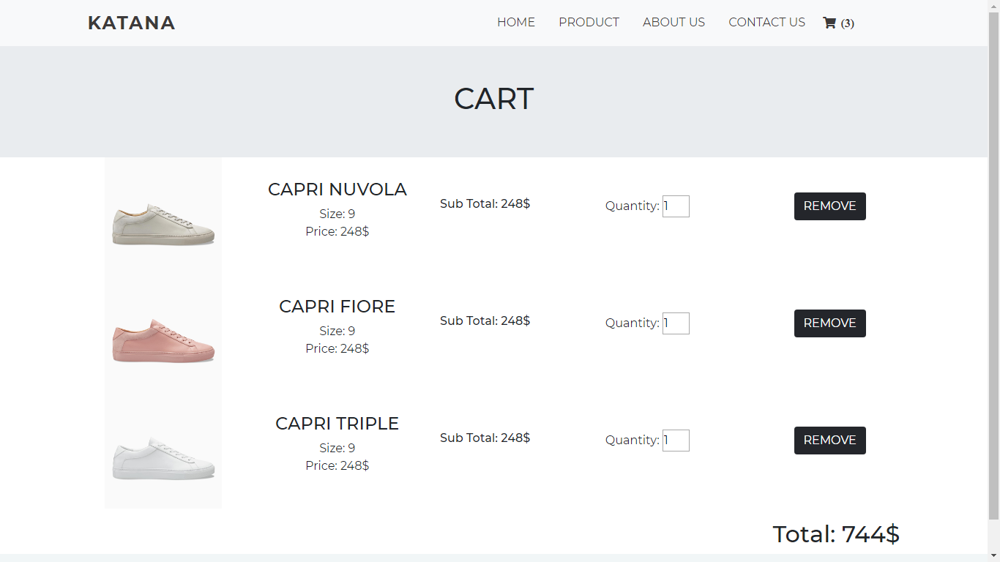

# ecommerce-frontend
A simple eCommerce frontend build with bootstrap and a little bit of vue.js

You can add, update & delete products from cart.

### Running Application
Git clone https://github.com/Satish196/ecommerce-frontend.git
 ```sh
 cd ecommerce-frontend
 ```
 Now open index.html file with your favorite browser or live server.
 
 Note: For Brave browser users directly running index.html file you may get error "Failed to read the 'localStorage' property from 'Window': Access is denied for this document." you need to run the application with live server or for demo you can use http://satishprajapati.tech/ecom/


### Few screenshot









